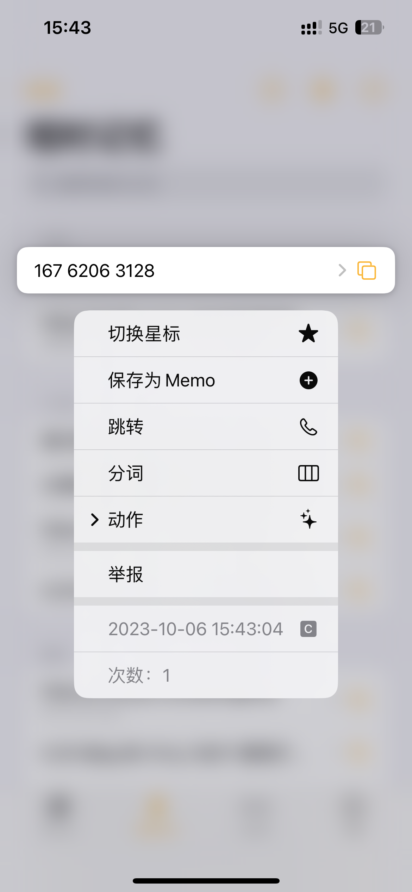

# 12321举报骚扰电话

因为频繁接到骚扰电话，与骚扰者抗议没有任何作用，运营商也没有很好的监管起来，我要做的就是用最少的步骤，让骚扰者不能再持续骚扰别人😡

## 举报流程

现在只需要少数的几步，**一分钟以内**，就可以完成骚扰电话的举报。

### 接到骚扰电话后复制
::: details

:::

### 进入Tomemo-短时记忆
::: details

:::

### 长按自动粘贴进来的记录

::: details

:::

### 点击「举报」后等待一会

点击后，会自动出现弹窗，并开始加载12321电话举报页面，**不要点击「我同意」按钮**，一切都如魔法般自动点击和加载内容。

会自动完成：
- 「我同意」点击
- 「您的手机号」填写，*需配置*
- 「验证码」识别和填写，*需配置*
- 「短信验证码」获取按钮点击，*需配置*
- 「被投诉电话号码」填写，*需配置*
- 骚扰设置，*需配置*

需要做的：
- 等待
- 点击「键盘」中的短信验证码
- 下拉到底
- 点击「投诉」

PS：短信验证码输入框在真实情况下有bug，点击短信验证码后，会输入两遍，需要手动删除多余的验证码😅。

::: details 自动填写

:::

### 完成投诉

::: details 举报成功

:::

## 举报设置

为了让上面部分操作自动填写，需要提前配置一些设置项（告诉应用不同的输入框中填入什么

**下面的两个配置的入口都在「设置」-「扩展」中。**

### 骚扰设置

#### 我的手机号
在此处输入投诉页面中「您的手机号」

#### 骚扰信息类型
点击添加按钮后，选择需要举报的骚扰类型。

每一个骚扰类型都内置了默认的「投诉描述」，可以点击后自行修改。

可以添加多条骚扰信息类型。

用于在短时记忆长按电话号码后，展示出来选择的举报模版。

#### 举报记录

在完成举报后，如果需要跟踪举报的进度，可以从此处进入。

进入后如同举报时一样，会自动填写手机号和验证码（*需要配置*），只需要点击收到的短信验证码和下一步，就可以快速查看曾经举报的那些骚扰电话记录。

### 验证码识别

验证码识别使用了第三方 [YesCaptcha](https://yescaptcha.com/i/Ox3VKA) 的识别服务，需要自己注册账号，并将密钥设置进来。

注册完成后，可添加客服联系方式，申请 1500 Points。

图形验证码每次调用消耗 2 Points，基本满足使用需要。

如果不需要自动识别验证码，则将密钥留空即可。

**没有配置，则无法自动识别验证码，在上面的操作流程中，需要手动输入验证码，并点击「发送验证码」。**